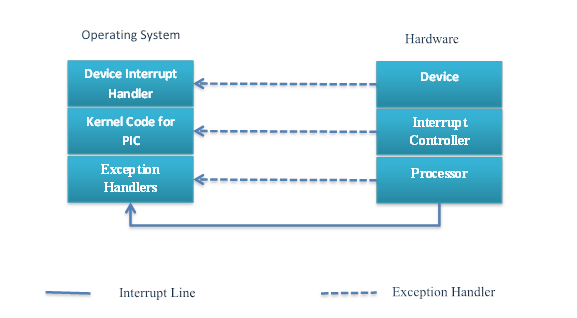
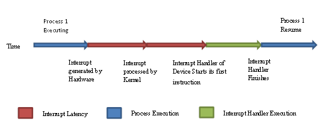
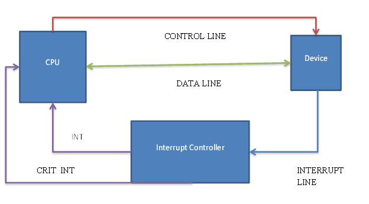

Journey of Interrupt
====================

SEPTEMBER 28, 2018 ~ SUNIL KUMAR

In embedded systems, the interrupt is the signal to the processor from
the hardware device indicating device needs immediate attention. It's
not only the hardware which can interrupt the CPU but software programs
can also interrupt the CPU from its normal processing. In brief; the
Interrupts are classified into below three categories:

§ Software Interrupts

§ Hardware Interrupts

Software Interrupts:
--------------------

Software interrupts are results of execution of instruction, generally
operating system uses software interrupts for implementations of system
calls. Processors support a special assembly level instruction for
handling the software interrupts.

**Architecture Instruction**

X86 INT

ARM SWI

PowerPC (PPC) SC

Hardware Interrupts:
--------------------

Hardware interrupts are the interrupts generated by the hardware
devices. . Hardware interrupts are further classified into internal and
external interrupts. This classification comes into picture because
latest processor have inbuilt devices within the System-On-Chip (SOC).
The devices which reside inside the SOC are internal device and hardware
device outside the SOC are external devices.

-   Internal Hardware Interrupts

-   External Hardware Interrupts

For handling interrupt it doesn't matter whether it's internal or
external, the processor handler both of them with same mechanism.

Interrupt Handling:
-------------------

Interrupt makes processor to deviate from its normal processing and
asked to serve the interrupt on higher priority. The processors save the
current context and start its journey to process the interrupt.

The time taken between device generates an interrupt and acknowledges by
corresponding interrupt handler is called the ***interrupt latency***.

Exception vs. Interrupts:
-------------------------

Before proceeding towards the interrupt, we should know the difference
between interrupt and exception. In brief

*"Exceptions are synchronous and Interrupts are asynchronous. "*

Exceptions occurs due to execution of instruction, in PPC data abort,
instruction abort are examples of exceptions. On the other hand,
interrupts can occur anytime; processor has to take action immediately
once interrupt has come.

Interrupt Controller:
---------------------

Interrupt can come from different sources it could be a device which is
embedded into SOC or may be connected outside SOC. So how processor know
interrupt came from which source. To serve this purpose addition
hardware is present called Interrupt controller. All the device
interrupt lines are connected to the interrupt controller. Interrupt
controller identifies from which IRQ line interrupt has occurred, but
interrupt controller keep this information within itself. It immediately
notifies the processor through dedicated exception that it got interrupt
from the device.

The hardware design for Interrupt controller is shown below:

During the initialization of the Interrupt controller it will assign the
interrupt number to each input IRQ line and its priority, the high
priority interrupt can go through the critical INT line (all based on
Interrupt Controller configuration). In case of multiple CPU Interrupt
controller has to be configured which interrupt goes to which CPU.

Suppose device wants to send data to CPU, it first needs to generate an
interrupt and interrupt controller find out from which IRQ line it got
interrupt, if multiple IRQ generates an interrupt it process higher
priority interrupt first, and send signal to CPU through INT (or
CRIT\_INT) line, and CPU raise an exception for the same. Now CPU
Exception handler for the interrupt controller gets executed and it
reads the interrupt number from the Interrupt Controller and
acknowledges the interrupt within the Interrupt controller. CPU looks if
any Interrupt Handler is register for the IRQ number, if so call the
device Interrupt handler. Now the device interrupt handler will
acknowledge the interrupt at device level and send the data to the CPU.

Summary:
--------

Interrupt is a signal to the processor; it can be from external device
or internal device within the SOC. Software interrupts are due to
instruction execution while Hardware interrupts are from peripherals.
Exceptions on the other hand are synchronous and Interrupts are
asynchronous. Interrupt Controller is the hardware device used for
managing the interrupt from the different sources; it decides the
priority of different interrupts.

References:
-----------

1.  <http://en.wikipedia.org/wiki/Interrupt>

2.  [http://ecomputernotes.com/fundamental/input-output-and-memory/what-is-interrupt-types-of-interrupt](http://ecomputernotes.com/fundamental/input-output-and-memory/what-is-interrupt-types-of-interrupts)
